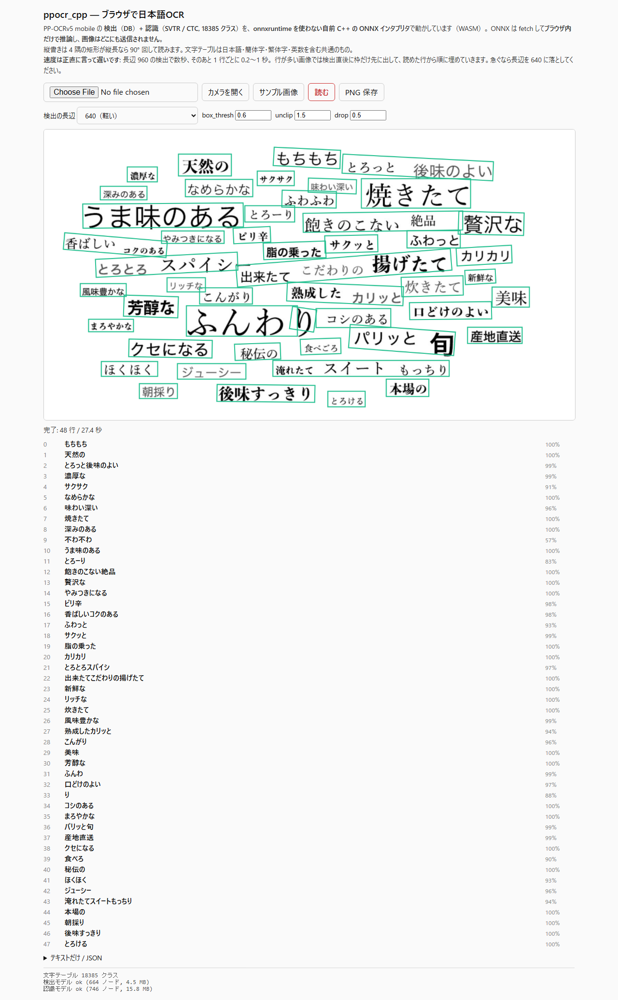
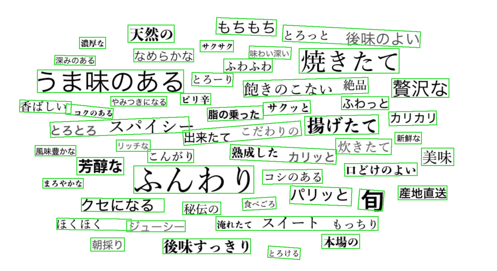

# ppocr_cpp — 日本語OCR（PP-OCRv5）を onnxruntime なしのスクラッチ C++ で、ブラウザまで

PaddleOCR の **PP-OCRv5 mobile**（検出 DB + 認識 SVTR/CTC・18385 クラス）を、
**推論ライブラリを一切使わない C++** で動かす。ONNX の protobuf を自前で読み、グラフを自前の
インタプリタで実行する。MSVC / mingw / Emscripten でビルドでき、**ブラウザ (WASM) デモ**まで含む。

姉妹リポジトリ: [yolo_lpr_cpp](https://github.com/yomei-o/yolo_lpr_cpp)（ナンバープレート）/
[crowd_cpp](https://github.com/yomei-o/crowd_cpp)（群衆検知）/
[cudnn_cpp](https://github.com/yomei-o/cudnn_cpp)（エンジン本体）。
`pure/onnx.hpp`（protobuf コーデック）と `pure/nd.hpp` などはこの系列から引き継ぎ、
**PP-OCR に必要な op と後処理をこのリポジトリで足した**。

## ▶ ブラウザで試す（送信なし・完全ローカル）

**https://yomei-o.github.io/ppocr_cpp/wasm/**

画像を渡すかカメラで撮ると、その場で読む。ONNX を fetch して WASM 内だけで推論するので
**画像はどこにも送信されない**。行数の多い画像では**検出直後に枠だけ先に出して、読めた行から順に
埋めていく**（1 行ごとに worker から結果が返る）。

[](https://yomei-o.github.io/ppocr_cpp/wasm/)

## 何が「スクラッチ」なのか

| 段 | やっていること | 実装 |
|---|---|---|
| ONNX 読み込み | protobuf を手書きコーデックでパース | `pure/onnx.hpp` |
| グラフ実行 | 664 ノード（検出）/ 746 ノード（認識）をインタプリタで実行 | `pure/onnx_run.hpp` |
| 前処理 | DetResizeForTest / NormalizeImage / resize_norm_img | `pure/img.hpp` |
| DB 後処理 | 輪郭追跡 → Douglas-Peucker → スコア → unclip → 最小外接矩形 | `pure/dbnet.hpp` |
| 切り出し | 4 点の射影変換 + 縦長なら 90° 回転 | `pure/img.hpp` |
| CTC | 文字テーブル構築 + greedy デコード | `pure/ctc.hpp` |
| 演算 | conv / 転置conv / プーリング / GEMM / softmax / LayerNorm 分解 ほか | `pure/ew.hpp`, `pure/onnx_run.hpp`, `pure/nd.hpp` |

`pure/` は **13 ファイル**（うち継承分は `onnx.hpp` / `autograd.hpp` / `nd.hpp` / `backend.hpp` /
`parallel.hpp` の 5 つだけ）。姉妹リポジトリの他の op ヘッダは、`ew.hpp` と `onnx_run.hpp` が
このパイプラインで使う分を全部置き換えたので**意図的に持ち込んでいない**。

依存は **stb_image（画像デコード）と vendored Eigen（GEMM・任意）だけ**。
onnxruntime も OpenCV も pyclipper も使わない。

## 正しさ — onnxruntime との一致

`tools/parity.py` が 2 段で検証する。上の段が本命。

**テンソル段**: `ppocr dump` が C++ 側の入力テンソルと出力テンソルを書き出し、同じ入力を
onnxruntime に食わせて差を取る。グラフ全体（664 / 746 ノード）を完全に独立な実装と突き合わせる。

| モデル | 入力 | 出力 | 最大絶対差 | 平均絶対差 | 相対 |
|---|---|---|---|---|---|
| 検出 | 1x3x512x960 | 1x1x512x960 | 1.03e-04 | 1.41e-07 | **1.0e-04** |
| 認識 | 1x3x48x310 | 1x39x18385 | 3.43e-05 | 1.68e-10 | **3.4e-05** |

float の丸め相当。**op の実装ミスはここに出る**（実際、開発中に stride=(2,1) 非対応・
1-D ブロードキャストの軸違いはここで捕まえた）。

**パイプライン段**: `ppocr run --json` と `tools/ppocr_ref.py --json`（onnxruntime + cv2 +
pyclipper、つまり **PaddleOCR 自身のアルゴリズムを PaddleOCR 自身のライブラリで**）を、
枠を IoU で対応付けてテキストごと比較する。

| 画像 | 枠 | 対応した枠 | テキスト一致 | 角の最大ずれ（中央値 / p90 / max） |
|---|---|---|---|---|
| `assets/japan_2.jpg`（50 行） | 50 / 49 | 49 | **47 / 49** | 1.0 / 1.0 / 3.0 px |
| `assets/page_ja.png`（23 行） | 23 / 23 | 23 | **21 / 23** | 1.0 / 2.0 / 6.0 px |

食い違いは全部 unclip の近似（下の「限界」）由来で、`不わふわ` / `ふわふわ` のように
**どちらが勝つかは画像次第**（`ジューシー` / `ューシー` はこちらが正しい）。

**WASM と native も一致**: `wasm/test_node.js`（WASM）と `ppocr run`（native）は
`japan_2.jpg` の **50 行すべてで同一の文字列**を返し、**枠の座標も 50 個すべて完全一致**する。

**ページの見た目まで確認する**: `tools/wasm_smoke.py` が playwright で実際のブラウザに読ませ、
枠の座標・canvas の実寸・スクリーンショットを取る。数値が合っていても**描画位置がずれる**バグは
`test_node.js` では絶対に見つからない（実際に一度やった。原因は下記）。

## 実際の読み取り結果



`assets/japan_2.jpg`（PaddleOCR の日本語サンプル、1536x839、50 行）:

```
もちもち / 天然の / とろっと後味のよい / 濃厚な / サクク / なめらかな / 味わい深い / 焼きたて
深みのある / 不わふわ / うま味のある / とろ-り / 飽きのこない絶品 / 贅沢な / やみつきになる ...
```

`assets/page_ja.png`（`tools/make_test_image.py` が生成する縦横混在ページ）:

```
第三章 走行中の異常と対処
エンジンの回転が不安定なときは、まず燃料フィルタの詰まりを確認してください。
警告灯が点灯した場合は安全な場所に停車し、取扱説明書の128ぺ一ジを参照。
型式GX-4200/製造番号SN-2024-018837/定格出力3.6kW（50Hz）
点検は3,000kmごと、または6ヶ月ごとに実施
```

横書きは実用域。**縦書きは列が細切れになる**（`春は` / `あ` / `け` / `ぼ` / `の` …）。
これは自前実装のせいではなく、`tools/ppocr_ref.py`（PaddleOCR 本来の実装）でも
**同じ 23 枠に割れる** — DB 検出器が「行」を探すよう学習されているため。

## 速度（正直な数字）

Ryzen デスクトップ 1 台での実測。`japan_2.jpg`（1536x839・50 行）を 1 枚読む時間。

| ビルド | 検出（長辺 960） | 認識 50 行 | 1 行あたり |
|---|---|---|---|
| native（Eigen + `-DPURE_SERIAL`） | **0.93 s** | **5.1 s** | 102 ms |
| native（長辺 640・48 行） | 0.40 s | 4.5 s | 94 ms |
| WASM（node, 単スレッド） | 3.2 s | 6.8 s | 136 ms |

認識の合計は検出解像度に**依存しない**（切り出しは元画像から取るため）。

### 速くするために効いたこと（測って分かったこと）

| 変更 | 効果 |
|---|---|
| `std::exp` を自前の `fm::exp_` に（`pure/fastmath.hpp`） | この mingw の `std::exp` は **152 ns/call**。検出の出力 Sigmoid（512x960）が 165 ms、認識の CTC head Softmax（39x18385）が 150 ms を食っていた → **4.3 ns/call**、相対誤差 4e-6 |
| 要素演算をループ境界のホイストされた実装に（`pure/ew.hpp`） | 継承した engine は `for (i < o->numel())` と書いており、`numel()` は shape の accumulate。ベクトル化が死んで **20 ns/要素**（素の float 加算の実測は 0.3 ns/要素）。認識 1 行が 419 → **181 ms** |
| 重みを 1 回だけ実体化（`onx::Weights`） | paddle2onnx は重みを **Constant ノード**として吐く（initializer が 0 個）。毎行 16 MB を確保・ゼロ埋め・コピーしていた |
| 中間テンソルを最終読み手の直後に解放 | ピークが「全活性化の総和」から「同時に生きている分」になる。大きな入力を WASM に載せる前提 |
| 逆伝播用 grad を確保しない（`infer_only()`） | 全 op が data と同サイズの grad を確保・ゼロ埋めしていた |
| **`-DPURE_SERIAL`**（スレッドを使わない） | 19 s → 10 s（当時）。1 行 48x数百 px の小さい op が数百個なので、**並列化の方が高い**。OpenMP なしだと呼び出しごとにスレッド生成、OpenMP ありだと Eigen 内部の GEMM 並列と食い合う |

GEMM 単体の実測（このマシン、`M=240 K=240 N=936`）: Eigen 単スレッド **32 GFLOPS** /
Eigen + OpenMP 21 GFLOPS / 素のループ + OpenMP 10 GFLOPS。**小さい行列では単スレッドが最速**。

## 使い方

```sh
# ビルド（推奨: Eigen あり・スレッドなし）
EXTRA="-DUSE_EIGEN -mavx2 -mfma -DPURE_SERIAL" sh build/gcc.sh pure/ppocr.cpp -o ppocr.exe
EXTRA="-DUSE_EIGEN -arch:AVX2 -DPURE_SERIAL"    sh build/cc.sh  pure/ppocr.cpp -o ppocr.exe  # MSVC

./ppocr.exe run  --img assets/japan_2.jpg --out result.png     # 検出 + 認識
./ppocr.exe run  --img photo.jpg --json --limit 640            # JSON、軽め
./ppocr.exe det  --img photo.jpg --out boxes.png               # 検出だけ
./ppocr.exe rec  --img line.png                                # 切り出し済み 1 行だけ
./ppocr.exe info --onnx models/ppocrv5-mobile-det.onnx         # op ヒストグラム
./ppocr.exe bench --img line.png --model rec --repeat 10       # op 種別の時間
./ppocr.exe dump --img photo.jpg --model det --out d.bin       # parity 用

# WASM
sh build/emcc.sh wasm/ppocr_wasm.cpp -o wasm/ppocr.js
./ppocr.exe rgba --img assets/japan_2.jpg --out scratch/sample.rgba
node wasm/test_node.js                                          # ブラウザなしの動作確認（数値）
python -m playwright install chromium                           # 初回だけ
python tools/wasm_smoke.py --out scratch/wasm_page.png          # 実ブラウザで動かして撮る
python -m http.server 8000                                      # → localhost:8000/wasm/

# Python 側（参照実装とパリティ）
python tools/ppocr_ref.py --img assets/japan_2.jpg
python tools/parity.py    --img assets/japan_2.jpg --line assets/line_ja.png
python tools/make_test_image.py --out assets/page_ja.png
```

主なオプション: `--limit`（検出の長辺・既定 960）`--min`（長辺ではなく短辺を合わせる）
`--thresh`（二値化 0.3）`--box-thresh`（枠の採用 0.6）`--unclip`（1.5）`--drop`（認識の採用 0.5）。

## モデル

| ファイル | 中身 | サイズ |
|---|---|---|
| `models/ppocrv5-mobile-det.onnx` | PP-OCRv5 mobile 検出（DB / PP-LCNetV3） | 4.7 MB |
| `models/ppocrv5-mobile-rec.onnx` | PP-OCRv5 mobile 認識（SVTR + CTC, 18385 クラス） | 16.5 MB |
| `models/ppocrv5_dict.txt` | 文字テーブル 18383 行（+ blank + space = 18385） | 92 KB |

PP-OCRv5 の認識モデルは**日本語・簡体字・繁体字・英数・拼音の共通モデル**（日本語専用ではない）。
学習済み重みは PaddleOCR（Apache-2.0）由来、ONNX 変換版を
[bukuroo/PPOCRv5-ONNX](https://huggingface.co/bukuroo/PPOCRv5-ONNX) から取得。

## インタプリタが対応している op

`Conv`（stride/pad/kernel を軸ごとに独立、group、depthwise 専用パス）`ConvTranspose`
`BatchNormalization` `MaxPool` `AveragePool`（軸ごと）`GlobalAveragePool` `Resize`（nearest）
`MatMul`（batched, GEMM 経由）`Gemm` `Softmax` `ReduceMean` `Add` `Sub` `Mul` `Div` `Pow` `Min`
`Max` `Sqrt` `Exp` `Log` `Abs` `Clip` `Relu` `Sigmoid` `Tanh` `HardSwish` `HardSigmoid`
`Concat` `Slice` `Split` `Reshape` `Transpose` `Squeeze` `Unsqueeze` `Flatten` `Shape` `Gather`
`Cast` `Constant` `Identity`。

**int64 の値経路がある**のがこの系列の他リポジトリとの差。PP-OCRv5 の認識器は行の幅が可変なので
`Shape → Slice → Concat → Reshape` で自分の reshape 先を実行時に計算する。float だけの
インタプリタでは `Shape` の出力すら表現できないため、shape 計算は別の int64 ストアに載せ、
`Slice` / `Concat` / `Squeeze` / `Gather` / `Cast` はどちらのストアに居るかで分岐する。

## 限界（分かっていて残していること）

- **unclip がポリゴンではなく矩形に対して行われる**。PaddleOCR は pyclipper で輪郭を
  オフセットしてから最小外接矩形を取る。ここでは最小外接矩形を d だけ太らせる
  （円との Minkowski 和なので、向きが同じなら厳密に一致する。向きは
  `(w+2d)(h+2d)` を最小化して選び直している）。実測の角のずれは中央値 1 px・最大 6 px、
  テキストが変わるのは 49 行中 2 行。
- **輪郭は外側だけ**追跡する。cv2 の `RETR_LIST` は穴の輪郭も返すが、それは box_thresh で
  落ちる候補しか生まないため。
- **縦書きは列が細切れになる**（上記のとおり参照実装でも同じ）。縦書きを真面目にやるなら
  検出側を差し替える必要がある（NDLOCR 系など）。
- **文字方向分類器（cls）を使っていない**ので、180° 回転した行は読めない。
- CTC は greedy のみ。ビームサーチも言語モデルも無い。
- 認識はバッチ 1 固定（1 行ずつ、行ごとの幅で推論）。
- 学習はできない。このリポジトリは**推論専用**（`infer_only()` を立てて grad を確保しない）。

## デモページで踏んだ罠

**枠を別の canvas に重ねて描くのをやめた**。最初は画像用 canvas の上に `position:absolute` の
overlay canvas を置いていたが、CSS に `video, canvas { display: block }` があるために
UA スタイルシートの `[hidden] { display: none }` が上書きされ、**`hidden` にした `<video>` が
既定の 300x150 を占めたまま画像を押し下げる**一方、overlay は `top:0` に留まって
**枠が画像とずれた**。border と box-sizing の効き方でも同じ種類のずれが起きる。

いまは**単一の canvas** に、オフスクリーンに保持した元画像を毎回描き直してから枠を描く。
同じバッキングストア内なのでずれようがなく、`getImageData` も枠を含まないため
**同じフレームを再実行しても検出器に自分の描いた枠を食わせない**。

## ライセンス

このリポジトリ自身のコードは BSD 3-Clause（`LICENSE`）。同梱の第三者ファイルと
学習済み重みはそれぞれのライセンスに従う — `THIRD_PARTY_NOTICES.md` を参照。
